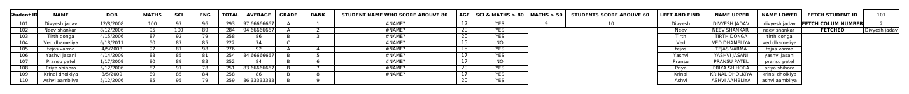
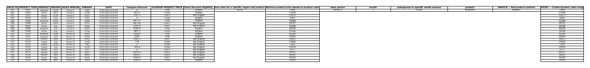
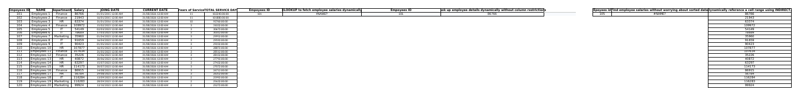

<div align="center">

# -- ! Excel Formula Practice Workbook ! --
### *Student Grades · Sales Analytics · Employee Records — Built with Excel Formulas*

[](https://www.microsoft.com/excel)
[](https://www.microsoft.com/excel)
[](https://www.microsoft.com/excel)
[](https://www.microsoft.com/excel)

<br/>

> *"A spreadsheet is only as smart as the formulas driving it."*

</div>

---

## 📋 Table of Contents

- [📌 Overview](#-overview)
- [🎯 Problem Statement](#-problem-statement)
- [✨ Key Features](#-key-features)
- [🏗️ Project Structure](#️-project-structure)
- [🔄 Project Workflow](#-project-workflow)
- [🎓 Sheet A — Student Grade Analysis](#-sheet-a--student-grade-analysis)
- [💰 Sheet B — Sales Data Analysis](#-sheet-b--sales-data-analysis)
- [🧑‍💼 Sheet C — Employee Records](#-sheet-c--employee-records)
- [🛠️ Tech Stack](#️-tech-stack)
- [📈 Results & Insights](#-results--insights)
- [🏆 Advantages](#-advantages)
- [📄 License](#-license)
- [👤 Author](#-author)

---

## 📌 Overview

The **Excel Formula Practice Workbook** is a multi-sheet spreadsheet built to practice and demonstrate real-world Excel formula skills — lookups, conditional logic, text manipulation, and dynamic ranges — across three practical datasets: student grades, sales transactions, and employee records.

This project is designed to:
- Strengthen understanding of lookup functions (`VLOOKUP`, `XLOOKUP`, `XMATCH`)
- Practice conditional logic and eligibility checks with `IF`
- Apply text functions (`UPPER`, `LOWER`, `LEFT`, `MID`)
- Work with dynamic ranges using `OFFSET` and `INDIRECT`
- Compute aggregates like `SUM`, `AVERAGE`, and `SUMIFS`

---

## 🎯 Problem Statement

> **Objective:** Build a single workbook that showcases core-to-advanced Excel formulas across three realistic business scenarios.

Each sheet tackles a different domain — academics, sales, and HR — so the same formula toolkit (lookups, conditionals, text handling, dynamic references) gets exercised in different practical contexts.

| 📂 Sheet | 📄 Domain | 🔍 Focus |
|----------|-----------|----------|
| Student_grade | Academics | Grading, ranking, and text extraction |
| sales_data | Sales | Discounts, eligibility, and lookups |
| Empoyees_data | HR | Tenure calculation and dynamic lookups |

---

## ✨ Key Features

| Feature | Description |
|--------|-------------|
| 🔍 **Multi-Style Lookups** | `VLOOKUP` and `XLOOKUP` used side by side for comparison |
| 🧮 **Aggregation** | `TOTAL`, `AVERAGE`, and `SUMIFS`-style region/product totals |
| 🏅 **Ranking & Grading** | Rank by score and letter-grade classification (A/B/C) |
| ✅ **Conditional Eligibility** | `IF`-based discount and eligibility checks |
| ✂️ **Text Functions** | `LEFT`, `UPPER`, `LOWER` for name formatting and extraction |
| 🎯 **XMATCH** | Finds a product's position dynamically within a list |
| 📐 **OFFSET** | Builds a dynamic sales range that adjusts automatically |
| 🔗 **INDIRECT** | References cell ranges dynamically by text address |
| 📅 **Date Math** | Years-of-service and total-days calculations from join dates |

---

## 🏗️ Project Structure

```
📦 excel-formula-practice/
│
├── 📊 PR_1.xlsx              ← Main workbook (entry point)
│   ├── 🎓 Student_grade      ← Sheet 1: grades, ranks, text functions
│   ├── 💰 sales_data         ← Sheet 2: discounts, lookups, XMATCH/OFFSET
│   └── 🧑‍💼 Empoyees_data     ← Sheet 3: tenure, XLOOKUP, INDIRECT
│
└── 📄 README.md              ← Project documentation
```

---

## 🔄 Project Workflow

```
Open Workbook
      │
      ▼
┌─────────────────────────────┐
│   Choose a Sheet             │  ← Student_grade / sales_data / Empoyees_data
└────────────┬────────────────┘
             │
     ┌───────┼────────────────┐
     ▼                ▼                ▼
┌─────────────┐ ┌──────────────┐ ┌──────────────────┐
│ Student_grade│ │  sales_data  │ │  Empoyees_data    │
│ Grade+Rank   │ │ Discount+Lookup│ │ Tenure+XLOOKUP   │
└──────┬──────┘ └──────┬───────┘ └────────┬──────────┘
       │                │                  │
       ▼                ▼                  ▼
┌─────────────────────────────────────────────────┐
│      Formulas Compute & Display Results          │
└───────────────────────────────────────────────────┘
```

---

## 🎓 Sheet A — Student Grade Analysis

### 📝 What it does

Tracks 10 students' marks across Maths, Science, and English, then derives totals, averages, letter grades, and ranks — plus a set of formula demonstrations alongside the core table.

**Core Logic:**
```
TOTAL    = MATHS + SCI + ENG
AVERAGE  = TOTAL / 3
GRADE    = IF-based tier on AVERAGE (A / B / C)
RANK     = RANK() on AVERAGE across all students
```

**Additional formula demos on the same sheet:**

| Column | Purpose |
|--------|---------|
| Student Name Who Scored Above 80 | Conditional name lookup |
| Age | Computed from Date of Birth |
| SCI & MATHS > 80 | Dual-condition `IF` check → YES/NO |
| Students Score Above 60 | Threshold filter |
| LEFT and FIND | Text extraction from full name |
| Name Upper / Name Lower | `UPPER()` / `LOWER()` case conversion |
| Fetch Student ID | `VLOOKUP`/`INDEX-MATCH` style ID retrieval |

**📸 Sheet Preview:**


---

## 💰 Sheet B — Sales Data Analysis

### 📝 What it does

Logs 20 sales transactions across products, regions, and salespeople, then layers on discount logic, lookups, and dynamic ranges.

**Core Logic:**
```
DISCOUNT ELIGIBILITY = IF(AMOUNT > threshold, "Eligible", "Not Eligible")
PRODUCT PRICE        = VLOOKUP(product code, price table)
DYNAMIC RANGE         = OFFSET(base cell, rows, cols)
PRODUCT POSITION      = XMATCH(product, product list)
```

**Additional formula demos:**

| Column | Purpose |
|--------|---------|
| Compute Discount | Calculated discount amount per sale |
| VLOOKUP Product Price | Price lookup by product code |
| Sum Sales for Region & Product | Multi-condition sales total |
| Retrieve Product Price by Code | Reverse lookup demo |
| Salesperson in Specific Month Amount | Month-filtered lookup |
| XMATCH — Find Product Position | Dynamic index of a product |
| OFFSET — Create Dynamic Sales Range | Range that resizes with data |

**📸 Sheet Preview:**



---

## 🧑‍💼 Sheet C — Employee Records

### 📝 What it does

Maintains 20 employee records with department, salary, and join date, then computes tenure and demonstrates modern dynamic lookups.

**Core Logic:**
```
YEARS OF SERVICE = YEAR(CURRENT DATE) - YEAR(JOINING DATE) (approx.)
TOTAL SERVICE DAYS = CURRENT DATE - JOINING DATE
SALARY LOOKUP       = XLOOKUP(employee ID, ID column, salary column)
DYNAMIC REFERENCE    = INDIRECT(cell address as text)
```

**Additional formula demos:**

| Column | Purpose |
|--------|---------|
| XLOOKUP to Fetch Employee Salaries | Modern lookup replacing VLOOKUP |
| Look Up Employee Details Dynamically | Lookup without column-index restrictions |
| Find Salaries Without Sorted Data | Lookup independent of sort order |
| Dynamically Reference a Cell Range | `INDIRECT()` in action |

**📸 Sheet Preview:**


---

## 🛠️ Tech Stack

| Tool | Purpose |
|------|---------|
| 📊 **Microsoft Excel** | Core spreadsheet application |
| 🔍 **VLOOKUP / XLOOKUP** | Value lookups across tables |
| 🎯 **XMATCH** | Positional lookup within a range |
| 📐 **OFFSET / INDIRECT** | Dynamic range and reference building |
| ➗ **IF / Nested IF** | Conditional logic and eligibility checks |
| ✂️ **LEFT / UPPER / LOWER / FIND** | Text extraction and formatting |
| 📅 **Date Functions** | Age and tenure calculations |
| 🧮 **SUM / AVERAGE / RANK** | Core aggregation and ranking |

---

## 📈 Results & Insights

After opening the workbook, each sheet produces:

- ✅ **Student_grade** — Totals, averages, letter grades, and ranks for all 10 students
- 💰 **sales_data** — Discount eligibility and computed discount for each of 20 sales
- 🧑‍💼 **Empoyees_data** — Years of service and total service days for all 20 employees
- 🔍 **Cross-sheet formula demos** — Working examples of `VLOOKUP`, `XLOOKUP`, `XMATCH`, `OFFSET`, and `INDIRECT` side by side for comparison

---

## 🏆 Advantages

| Advantage | Detail |
|-----------|--------|
| 🎓 **Practical Practice** | Real-world scenarios instead of abstract formula drills |
| 🔄 **Formula Comparison** | `VLOOKUP` vs `XLOOKUP` shown on related data for direct comparison |
| 📚 **Educational** | Each sheet isolates a different formula category |
| 🖥️ **No Add-ins Needed** | Works with native Excel functions only |
| 🧪 **Extensible** | Easy to add new columns, sheets, or formula demos |
| 📖 **Self-Documenting** | Column headers describe the formula purpose directly |

---

## 📄 License

This project is for personal learning and practice.

---

## 👤 Author

<div align="center">

### Divyesh Jadav

> *"Every dataset tells a story — formulas just help you read it faster."*

**🎓 Focus:** Excel · Data Analysis · AI/ML · Data Science \
**🛠️ Skills:** Excel Formulas · Lookups · Conditional Logic · Data Analysis

</div>

---

<div align="center">

*Last updated: 31 August, 2026*

</div>
