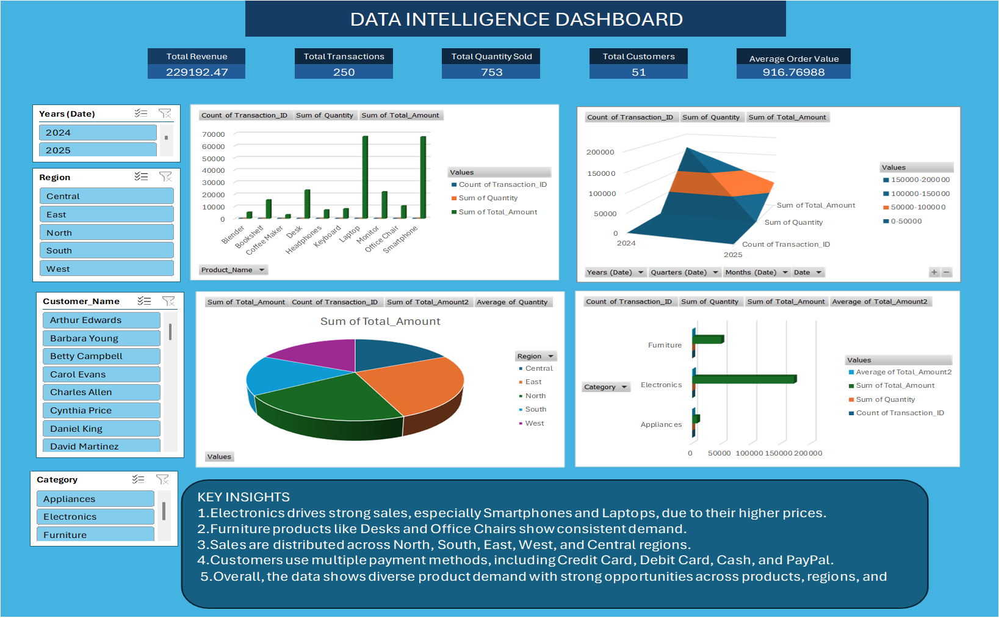
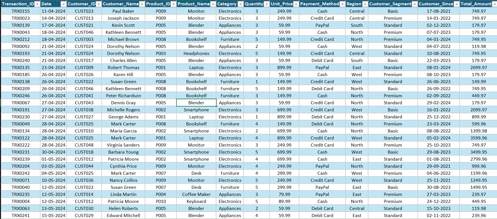
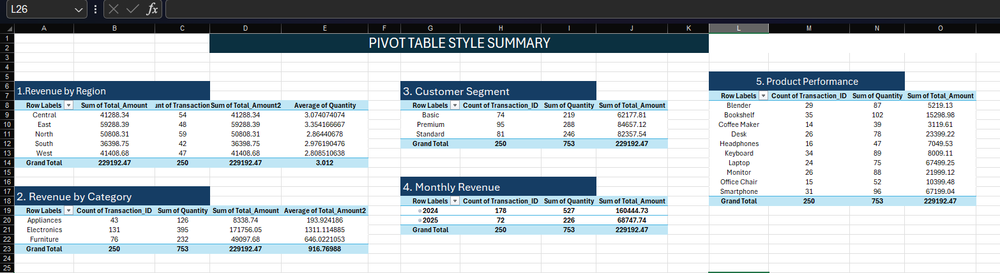
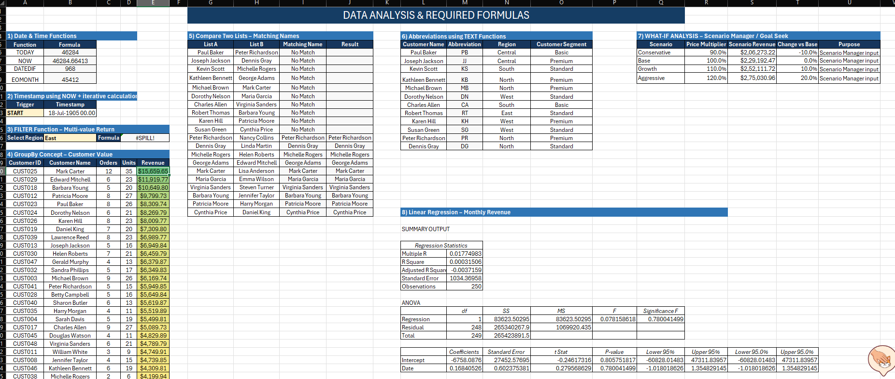

<div align="center">

# 📊 Data Intelligence Dashboard — Excel Project
### *Interactive Excel Workbook: Raw Data, Pivot Analysis, Advanced Formulas & Dashboard*

[](https://www.microsoft.com/excel)
[](https://www.microsoft.com/excel)
[](https://www.microsoft.com/excel)
[](https://www.microsoft.com/excel)

<br/>

> *"Raw data tells a story — pivots, formulas and dashboards just help you read it."*

</div>

---

## 📋 Table of Contents

- [📌 Overview](#-overview)
- [🎯 Objective](#-objective)
- [🏗️ Workbook Structure](#️-workbook-structure)
- [🔄 Project Workflow](#-project-workflow)
- [📋 Raw Data](#-raw-data)
- [📊 Pivot Table Analysis](#-pivot-table-analysis)
- [🧮 Advanced Formula Analysis](#-advanced-formula-analysis)
- [📈 Interactive Dashboard](#-interactive-dashboard)
- [🛠️ Tech Stack](#️-tech-stack)
- [📄 License](#-license)
- [👤 Author](#-author)
- [🙏 Acknowledgements](#-acknowledgements)

---

## 📌 Overview

The **Data Intelligence Dashboard** is an Excel-based data analysis project built on a set of
**retail sales transactions**. It takes raw transaction records through
**raw data → pivot summaries → advanced formulas → an interactive dashboard**, all inside a
single `.xlsx` workbook — no external tools or add-ins required.

This project is designed to:
- Practice real-world spreadsheet reporting on transactional data
- Build PivotTable summaries that break revenue down by region, category, segment and month
- Demonstrate advanced Excel formulas (date functions, dynamic filters, GroupBy-style ranking,
  text functions, What-If scenarios, and regression)
- Present findings through KPI cards, PivotCharts, and interactive slicers

---

## 🎯 Objective

> **Goal:** Turn raw retail transaction records into a clean, analyzable dataset and present the
> results through pivot tables, formulas, and a one-page interactive dashboard.

| 📂 Component | 📄 Type | 🔍 Description |
|---|---|---|
| Raw Data | Sheet | 250 original transaction records |
| Pivot Tables | Sheet | Revenue/quantity broken down by region, category, segment, month, product |
| Analysis | Sheet | Date functions, lookups, GroupBy, What-If, regression demos |
| Dashboard | Sheet | KPI cards, charts, and slicer-driven interactive view |

---

## 🏗️ Workbook Structure

```
📦 fainal_project_001.xlsx
│
├── 📄 Dashboard          ← KPI cards + charts + slicers (front page)
├── 📄 Raw Data            ← 250 original transaction records
├── 📄 Pivot Tables         ← 5 pivot-style summary tables
└── 📄 Analysis             ← Formulas, scenarios, and regression demos
```

---

## 🔄 Project Workflow

```
Raw Data (250 transactions)
      │
      ▼
┌───────────────────────────────┐
│   Pivot Tables                │  ← Revenue/quantity summarized by
│   (region / category /        │    region, category, segment, month, product
│    segment / month / product) │
└───────────────┬───────────────┘
                │
        ┌───────┴────────┐
        ▼                ▼
┌───────────────┐   ┌──────────────────┐
│  Analysis      │   │   Dashboard      │
│ (dates, filter,│   │ (KPI cards,      │
│  GroupBy,      │   │  charts, slicers)│
│  What-If,      │   │                  │
│  regression)   │   │                  │
└────────────────┘   └──────────────────┘
```

---

## 📋 Raw Data

The `Raw Data` sheet holds 250 transaction records with the following fields:

| Field | Description |
|---|---|
| `Transaction_ID` | Unique transaction identifier |
| `Date` | Transaction date |
| `Customer_ID` / `Customer_Name` | Customer identifier and name |
| `Product_ID` / `Product_Name` | Product identifier and name |
| `Category` | Electronics / Appliances / Furniture |
| `Quantity` | Units purchased |
| `Unit_Price` | Price per unit |
| `Payment_Method` | Cash / Credit Card / Debit Card / PayPal |
| `Region` | Central / East / North / South / West |
| `Customer_Segment` | Basic / Standard / Premium |
| `Customer_Since` | Date the customer first purchased |
| `Total_Amount` | `Quantity × Unit_Price` |

---

## 📊 Pivot Table Analysis

`Pivot Tables` summarizes the raw data into five views:

| # | Pivot View | Top Result |
|---|---|---|
| 1 | Revenue by Region | East – $59,288.39 |
| 2 | Revenue by Category | Electronics – $171,756.05 |
| 3 | Revenue by Customer Segment | Premium – $84,657.12 |
| 4 | Monthly Revenue | 2024 – $160,444.73 · 2025 – $68,747.74 |
| 5 | Product Performance | Laptop – $67,499.25 |

---

## 🧮 Advanced Formula Analysis

`Analysis` demonstrates eight core Excel skills side by side with live results:

| # | Formula Skill | What It Does |
|---|---|---|
| 1 | `TODAY` / `NOW` / `DATEDIF` / `EOMONTH` | Date & time calculations |
| 2 | Timestamp Trigger | Logs a timestamp using `NOW` |
| 3 | Dynamic Filter | Returns all transactions for a selected region |
| 4 | GroupBy — Customer Value | Ranks customers by orders, units, and revenue |
| 5 | List Comparison | Matches names across two customer lists |
| 6 | Text Abbreviation | Generates initials from customer names |
| 7 | What-If Analysis | Scenario modeling: Conservative / Base / Growth / Aggressive |
| 8 | Linear Regression | Trend analysis of monthly revenue over time |

---
### OUTPUT Screenshort


---
---


---
---


---
---


---
---

## 📈 Interactive Dashboard

The `Dashboard` sheet is the front page of the workbook: **KPI cards** (Total Revenue, Total
Transactions, Total Quantity Sold, Total Customers, Average Order Value), plus **PivotCharts**
and **slicers** for interactive filtering.

| Metric | Value |
|---|---|
| Total Revenue | $229,192.47 |
| Total Transactions | 250 |
| Total Quantity Sold | 753 |
| Total Customers | 51 |
| Average Order Value | $916.77 |

> Use the **slicers** to filter the dashboard by Category, Segment, or Region.

---

## 🛠️ Tech Stack

| Tool | Purpose |
|---|---|
| 🟢 **Microsoft Excel 2016+** | Core spreadsheet application |
| 📊 **PivotTables / PivotCharts** | Summarized, visual reporting |
| 🎛️ **Slicers** | Interactive cross-filtering |
| 🗓️ **Date Functions** | `TODAY`, `NOW`, `DATEDIF`, `EOMONTH` |
| ➗ **SUMIFS / Formulas** | Conditional aggregation & lookups |
| 🎯 **What-If Analysis** | Scenario Manager–style revenue modeling |
| 📉 **Regression** | Monthly revenue trend analysis |

---

## 📄 License

This project is for personal/educational use.

---

## 👤 Author

<div align="center">

## Divyesh jadav

**🛠️ Skills:** Excel · Data Analysis · Pivot Tables · Formulas · Dashboards

</div>

---

## 🙏 Acknowledgements

- 📊 [Microsoft Excel Support](https://support.microsoft.com/excel) — Function reference
- 🧮 [ExcelJet](https://exceljet.net/) — Formula patterns and examples

---

<div align="center">

---

*Last updated: 19 September, 2026*

</div>
