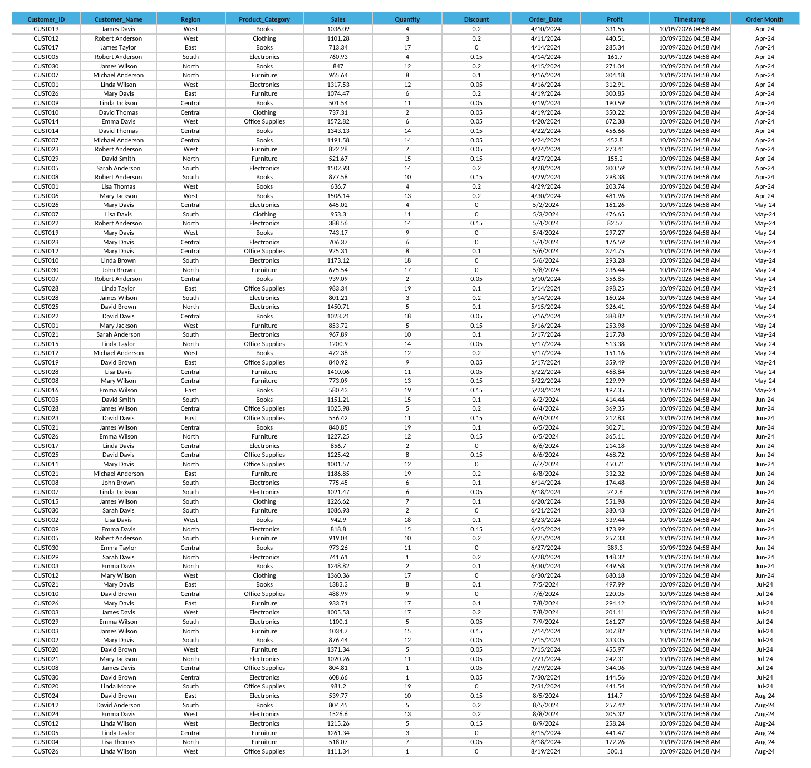
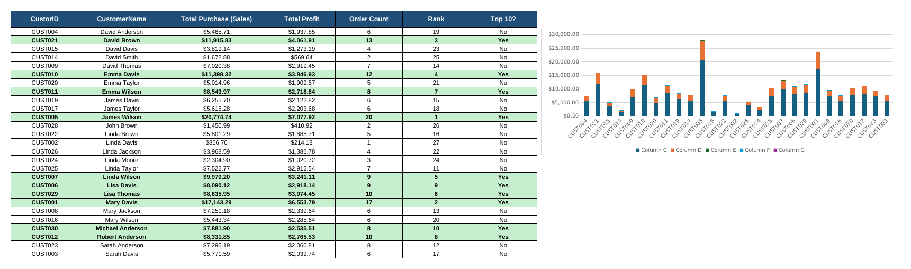
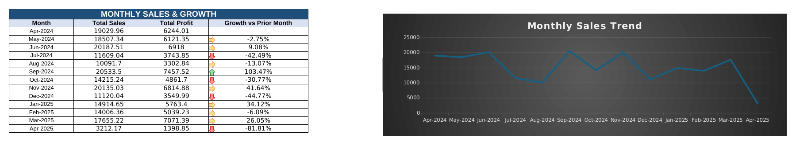
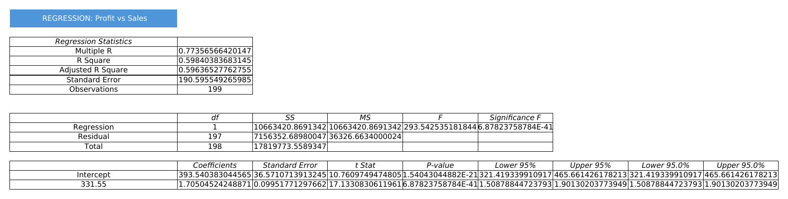
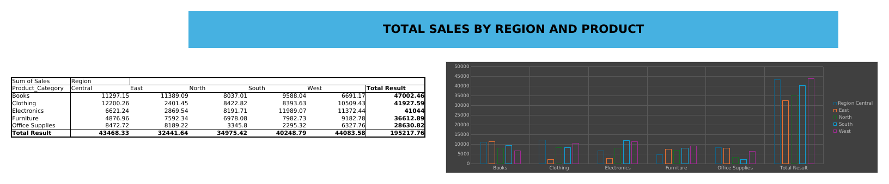
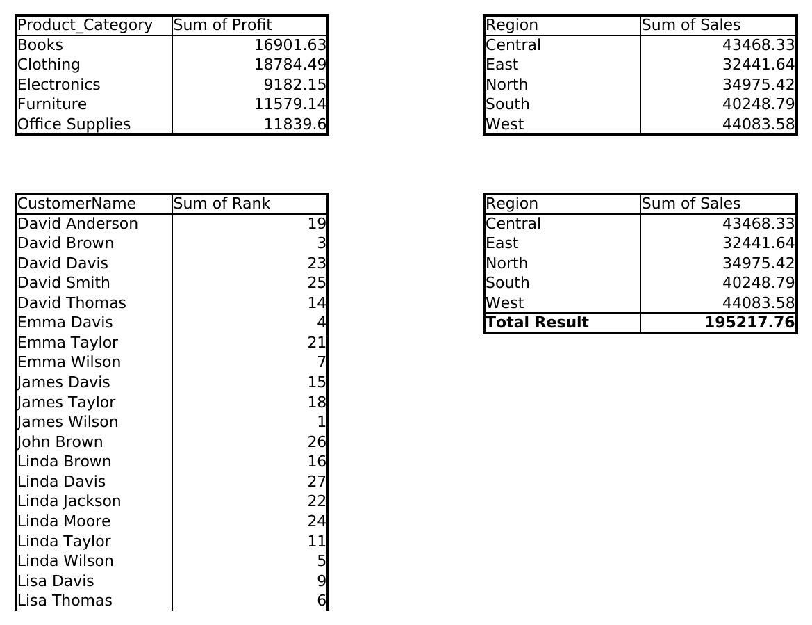

<div align="center">

# -- ! PR. 2 — Sales Analytics Workbook ! --
### *Excel-Based Sales Dashboard & Data Analysis Workbook*

[](https://www.microsoft.com/microsoft-365/excel)
[](https://www.microsoft.com/microsoft-365/excel)
[](https://www.microsoft.com/microsoft-365/excel)
[](https://www.microsoft.com/microsoft-365/excel)

<br/>

> *"A pivot table doesn't just summarize data — it lets the data argue its own case."*

</div>

---

## 📋 Table of Contents

- [📌 Overview](#-overview)
- [🎯 Problem Statement](#-problem-statement)
- [✨ Key Features](#-key-features)
- [🏗️ Project Structure](#️-project-structure)
- [🔄 Project Workflow](#-project-workflow)
- [📊 Sheet-by-Sheet Breakdown](#-sheet-by-sheet-breakdown)
- [🖼️ Screenshots](#️-screenshots)
- [🛠️ Tech Stack](#️-tech-stack)
- [📈 Results & Insights](#-results--insights)
- [🏆 Advantages](#-advantages)
- [📄 License](#-license)
- [👤 Author](#-author)
- [🙏 Acknowledgements](#-acknowledgements)

---

## 📌 Overview

**PR. 2** is a multi-sheet Excel workbook that transforms 199 raw sales transactions into a complete analytics package built with **real PivotTables, PivotCharts, and the Analysis ToolPak** — not formula workarounds. It ships a dark-themed executive dashboard, a customer-ranking pivot, a discount what-if model, monthly growth tracking, full descriptive statistics, and a ToolPak-generated linear regression report.

This project is designed to:
- Demonstrate native Excel BI features: PivotTables, PivotCharts, slicers, and the Analysis ToolPak
- Convert a raw transaction log into an executive-ready, dark-themed dashboard
- Rank and segment customers by total spend using a live pivot
- Model the profit impact of discount changes across six scenarios
- Track month-over-month sales growth with conditional arrow indicators
- Run a full linear regression (Profit vs. Sales) with ToolPak-standard output

---

## 🎯 Problem Statement

> **Objective:** Build a single Excel workbook that ingests raw sales transactions and produces a full analytical story — an executive dashboard, customer segmentation, scenario modeling, and statistical analysis — using PivotTables and the Analysis ToolPak.

You are given a raw log of customer orders (ID, region, category, sales, discount, profit, order date). The workbook must aggregate this data through genuine pivot objects (not just formulas), visualize it with PivotCharts on a dark executive dashboard, and surface deeper statistical relationships — trend, correlation, and customer value — across supporting sheets.

| 📂 Sheet | 📄 Type | 🔍 Description |
|----------|---------|-----------------|
| Dashboard | PivotCharts | Dark-themed executive view: 4 linked pivot charts |
| data | Source | The 199-row raw transaction dataset |
| CustomerSummary | Pivot + Ranking | Per-customer totals, order count, rank, Top-10 flag |
| WhatIf | Scenario Model | Discount-sensitivity simulator (0%–30%) |
| MonthlySales | Trend Table | Month-over-month sales & profit growth with arrows |
| DescriptiveStats | Statistics | Mean, median, mode, std. dev., kurtosis, skewness |
| Regression | ToolPak Output | Full ANOVA-style linear regression: Profit vs. Sales |
| PivotTable | Aggregation | Region × Category PivotTable with PivotChart |
| Dashboard tabal | Pivot Source | Backing pivot tables that feed the dashboard charts |

The goal is to demonstrate **native Excel business-intelligence features** end-to-end — the kind of workbook you'd hand to a manager who just wants the dashboard tab.

---

## ✨ Key Features

| Feature | Description |
|--------|-------------|
| 🌑 **Dark Executive Dashboard** | 4 linked PivotCharts (donut, bar, column, horizontal bar) on a navy background |
| 📊 **Real PivotTables** | Region × Category grid and per-customer rollups built with native Excel PivotTables |
| 🎚️ **Discount What-If Simulator** | A single input drives Adjusted Total Profit across 0%–30% discount scenarios |
| 📉 **Monthly Growth Tracking** | Sales & Profit by month with conditional up/down arrow formatting |
| 🧮 **Full Descriptive Statistics** | Mean, standard error, median, mode, std. dev., variance, kurtosis, skewness, range |
| 📐 **Analysis ToolPak Regression** | Complete regression output: R, R², ANOVA table, coefficients, confidence intervals |
| 🏅 **Customer Ranking** | All 27 customers ranked by total purchase value with a Top-10 highlight |
| 🗂️ **Pivot-Fed Dashboard** | A dedicated "Dashboard tabal" sheet holds the pivot sources that drive every dashboard chart |

---

## 🏗️ Project Structure

```
📦 pr2-sales-analytics/
│
├── 📊 PR_2.xlsx               ← Main workbook (all 9 sheets)
│
└── 📄 README.md               ← Project documentation
```

---

## 🔄 Project Workflow

```
data (199 raw transactions)
      │
      ▼
┌─────────────────────────────────┐
│   PivotTables + Analysis ToolPak │
└───────────────┬───────────────────┘
                │
   ┌────────────┼─────────────┬───────────────┬────────────────┐
   ▼             ▼             ▼               ▼                ▼
┌───────────┐ ┌────────┐ ┌────────────┐ ┌────────────┐ ┌──────────────┐
│CustomerSum│ │ WhatIf │ │MonthlySales│ │ Regression │ │DescriptiveSt.│
│ Rank +    │ │Discount│ │  Growth    │ │ Profit vs  │ │ Mean/Median/ │
│ Top-10    │ │Scenario│ │  Trend     │ │  Sales     │ │ Kurtosis     │
└───────────┘ └────────┘ └────────────┘ └────────────┘ └──────────────┘
                │
                ▼
        ┌────────────────┐        ┌──────────────────┐
        │   PivotTable    │        │  Dashboard tabal  │
        │ Region × Cat.   │        │  Pivot sources     │
        │ + PivotChart    │        │  for the dashboard  │
        └────────────────┘        └──────────┬─────────┘
                                              │
                                              ▼
                                     ┌──────────────────┐
                                     │     Dashboard      │
                                     │  4 dark PivotCharts │
                                     └──────────────────┘
```

---

## 📊 Sheet-by-Sheet Breakdown

### 1️⃣ Dashboard

> The executive view: a dark navy background with four PivotCharts — a donut for Sales by Region, a column chart for Sum of Profit by Category, a bar chart for Sales by Region, and a horizontal bar ranking customers. Built entirely from linked pivot caches, not static images.

---

### 2️⃣ data — Raw Transactions

> The source of truth: 199 rows of Customer ID, Name, Region, Product Category, Sales, Quantity, Discount, Order Date, Profit, Timestamp, and Order Month.

---

### 3️⃣ CustomerSummary — Ranking Pivot

> Every customer's Total Purchase (Sales), Total Profit, and Order Count, with a computed **Rank** and a **Top 10?** flag. James Wilson leads at $20,774.74 in total purchases across 20 orders.

| CustomerID | Customer Name | Total Purchase | Total Profit | Orders | Rank | Top 10? |
|---|---|---|---|---|---|---|
| CUST005 | James Wilson | $20,774.74 | $7,077.92 | 20 | 1 | Yes |
| CUST001 | Mary Davis | $17,143.29 | $6,553.79 | 17 | 2 | Yes |
| CUST021 | David Brown | $11,915.83 | $4,061.91 | 13 | 3 | Yes |

---

### 4️⃣ WhatIf — Discount Sensitivity

> Edit the yellow **Total Profit at New Discount** input and watch the six-scenario table (0%–30%) recalculate. At the current 10% discount rate, the model shows a **$249 profit gap** versus the 9.73% actual average discount.

---

### 5️⃣ MonthlySales — Growth Tracking

> Thirteen months of Sales and Profit with a **Growth vs Prior Month** column driven by conditional arrow icons — bright green up arrows, red down arrows. September 2024 posted a standout **+103.5%** rebound after two consecutive down months.

---

### 6️⃣ DescriptiveStats

> Mean, Standard Error, Median, Mode, Standard Deviation, Sample Variance, Kurtosis, Skewness, Range, Min, Max, Sum, and Count — computed independently for Sales, Quantity, Discount, and Profit.

---

### 7️⃣ Regression — Analysis ToolPak Output

> A full ToolPak-style regression report for Profit vs. Sales, including the ANOVA table and 95% confidence intervals:

```
Multiple R      = 0.7736
R Square        = 0.5984
Observations    = 199
Intercept       = 393.54   (p < 0.001)
Slope (Sales)   = 1.705    (p < 0.001)
```

---

### 8️⃣ PivotTable — Region × Category

> A genuine Excel PivotTable (Sum of Sales, Region as columns, Product Category as rows) with an attached clustered-column PivotChart broken out by region.

---

### 9️⃣ Dashboard tabal — Pivot Source Sheet

> The quiet workhorse: four small pivot outputs (Profit by Category, Sales by Region, Rank by Customer, Sales by Region again) that feed the four charts on the Dashboard tab.

---

## 🖼️ Screenshots

### Dashboard


### data — Raw Transactions Table



### CustomerSummary — Ranking Table



### WhatIf — Discount Sensitivity Table


### MonthlySales — Growth Table



### DescriptiveStats Table


### Regression — Analysis ToolPak Output



### PivotTable — Sales by Region and Product



### Dashboard tabal — Pivot Source Tables



---

## 🛠️ Tech Stack

| Tool | Version | Purpose |
|------|---------|---------|
| 📊 **Microsoft Excel** | 2007+ | Core spreadsheet application |
| 🔄 **PivotTables & PivotCharts** | Built-in | Region/category/customer aggregation and dashboard visuals |
| 🧮 **Analysis ToolPak** | Add-in | Regression and descriptive statistics reports |
| 🎨 **Conditional Formatting** | Built-in | Up/down growth arrows, Top-10 row highlighting |
| 📈 **Data Bars / Icon Sets** | Built-in | Visual scenario highlighting on the WhatIf sheet |
| 🗂️ **Slicers** | Built-in | Interactive filtering on the pivot-backed dashboard |

---

## 📈 Results & Insights

After opening the workbook, the following outputs are produced:

- 💰 **$195,217.76 in Total Sales** across 199 orders, at a **$68,287.01** total profit
- 🏅 **James Wilson is the top customer**, with $20,774.74 in purchases across 20 orders
- 📊 **Clothing edges out Books** as the top category by profit ($18,784 vs. $16,902)
- 🌍 **West leads all regions** in sales at $44,083.58, narrowly ahead of Central ($43,468.33)
- 📉 **10 customers qualify as "Top 10"** by total spend, each contributing well above the median order value
- 📈 **Moderate-strong positive correlation** (Multiple R = 0.774, R² = 0.598) between Sales and Profit
- 🔄 **Volatile monthly growth**, swinging from -44.8% (Dec-24) to +103.5% (Sep-24), reflecting seasonal demand spikes

---

## 🏆 Advantages

| Advantage | Detail |
|-----------|--------|
| 🔄 **Refreshable Pivots** | Add new rows to `data` and refresh every pivot table/chart in one click |
| 🎓 **Real BI Features** | Uses actual PivotTables, PivotCharts, and the Analysis ToolPak — not formula substitutes |
| 🌑 **Presentation-Ready** | The dark dashboard theme is built for screen-sharing or exec review |
| 🖥️ **Single File** | One `.xlsx`, zero external dependencies beyond the built-in ToolPak |
| 🎚️ **Interactive** | The WhatIf sheet lets anyone test a discount scenario without touching source data |
| 🧪 **Extensible** | New regions, categories, or months slot straight into the existing pivot structure |
| 🛡️ **Rigorous Statistics** | Full ANOVA and confidence intervals, not just a slope and R² |

---

## 📄 License

This project is licensed under the **MIT License** — see the [LICENSE](LICENSE) file for full details.

```
MIT License — Free to use, modify, and distribute with attribution.
```

---

## 👤 Author

<div align="center">

### Divyesh jadav

[](https://github.com/)
[](https://www.linkedin.com/)

> *"Every great dashboard starts with a well-built pivot — just like every insight starts with clean data."*

**🎓 Role:** Data Analyst | Excel BI Enthusiast \
**📍 Location:** India \
**🛠️ Skills:** Excel · PivotTables/PivotCharts · Analysis ToolPak · Dashboards · Data Storytelling

</div>

---

## 🙏 Acknowledgements

Special thanks to the following resources that made this project possible:

- 📚 [Microsoft — Create a PivotTable](https://support.microsoft.com/en-us/office/create-a-pivottable-to-analyze-worksheet-data-a9a84538-bfe9-40a9-a8e9-f99134456576) — Official PivotTable guide
- 📊 [Microsoft — Analysis ToolPak](https://support.microsoft.com/en-us/office/use-the-analysis-toolpak-to-perform-complex-data-analysis-6c67ccf0-f4a9-487c-8dec-bdb5a2cefab6) — Regression & statistics add-in documentation
- 🔎 [ExcelJet — PivotTables](https://exceljet.net/pivot-tables) — Pivot table patterns and tips
- 📐 [Statistics How To — Linear Regression](https://www.statisticshowto.com/probability-and-statistics/regression-analysis/) — Regression concepts
- 💬 [Stack Overflow Community](https://stackoverflow.com/) — Formula and pivot troubleshooting support

---

<div align="center">

---

*Made with 📊 and ☕ — Last updated: 10 September, 2026*

</div>
